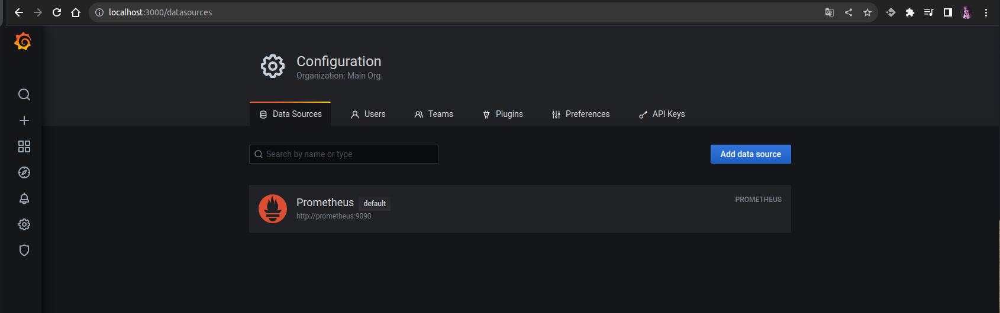

# Домашнее задание к занятию 14 «Средство визуализации Grafana»

### Задание 1

1. Cкриншот веб-интерфейса grafana со списком подключенных Datasource.

## Задание 2

Promql-запросы для выдачи этих метрик, а также скриншот получившейся Dashboard.

1. avg(100 - (rate(node_cpu_seconds_total{mode="idle"}[1m]) * 100))
2. node_load1 | node_load5 | node_load15
3. (1 - (node_memory_MemAvailable_bytes / (node_memory_MemTotal_bytes)))* 100

4.

Used: |
--- | 
| (node_filesystem_size_bytes{mountpoint="/"} - node_filesystem_free_bytes{mountpoint="/"}) | 
**Total:**
node_filesystem_size_bytes{mountpoint="/"} | 
**Available:**
(node_filesystem_size_bytes{mountpoint="/"}) - ((node_filesystem_size_bytes{mountpoint="/"} - node_filesystem_free_bytes{mountpoint="/"}))  

---

## Задание 3

1. Создайте для каждой Dashboard подходящее правило alert — можно обратиться к первой лекции в блоке «Мониторинг».
1. В качестве решения задания приведите скриншот вашей итоговой Dashboard.

## Задание 4

1. Сохраните ваш Dashboard.Для этого перейдите в настройки Dashboard, выберите в боковом меню «JSON MODEL». Далее скопируйте отображаемое json-содержимое в отдельный файл и сохраните его.
1. В качестве решения задания приведите листинг этого файла.

---

### Как оформить решение задания

Выполненное домашнее задание пришлите в виде ссылки на .md-файл в вашем репозитории.

---
