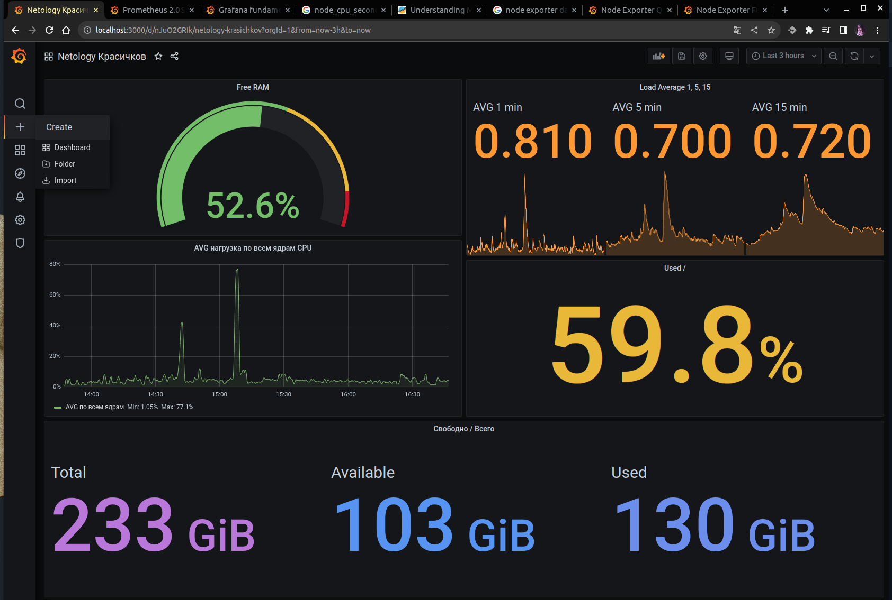
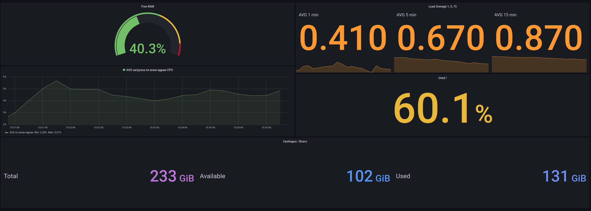
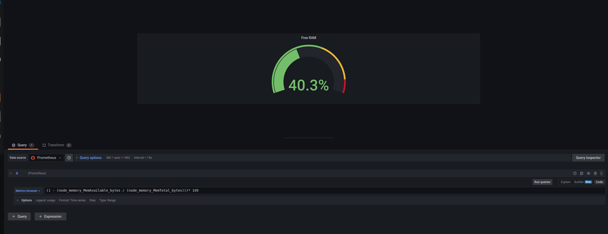

# Домашнее задание к занятию 14 «Средство визуализации Grafana»

### Задание 1

1. Cкриншот веб-интерфейса grafana со списком подключенных Datasource.

## Задание 2

Promql-запросы для выдачи этих метрик, а также скриншот получившейся Dashboard.

1. avg(100 - (rate(node_cpu_seconds_total{mode="idle"}[1m]) * 100))
2. node_load1 | node_load5 | node_load15
3. (1 - (node_memory_MemAvailable_bytes / (node_memory_MemTotal_bytes)))* 100

4.

Used: |
--- | 
| (node_filesystem_size_bytes{mountpoint="/"} - node_filesystem_free_bytes{mountpoint="/"}) | 
**Total:**
node_filesystem_size_bytes{mountpoint="/"} | 
**Available:**
(node_filesystem_size_bytes{mountpoint="/"}) - ((node_filesystem_size_bytes{mountpoint="/"} - node_filesystem_free_bytes{mountpoint="/"}))  

---

## Задание 3

Создайте для каждой Dashboard подходящее правило alert

**Получилось добавить алерт только на панель с нагрузкой по ядрам. На остальных панелях нет вкладки с алертами, скриншот прилагаю ниже. Буду признателен, если подскажете, что не так**

___

---
## Задание 4

[Json](./dashboard.json)

---
