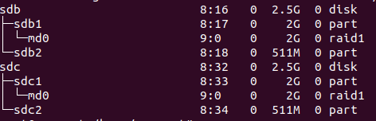
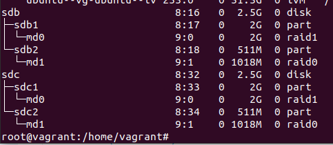

# **ДЗ**  | 3.5. Файловые системы
1. Разрежённый файл (англ. sparse file) — файл, в котором последовательности нулевых байтов[1] заменены на информацию об этих последовательностях (список дыр).
2. Нет, файлы будут иметь одинаковые права доступа, так как, фактически, жесткая ссылка это еще одно имя того же файла.
3. Создал
4. Просматриваю неразмеченные диски:
```
sudo fdisk -l
```
/dev/sdb и /dev/sdc два неразмеченных диска по 2.5гб.

Начинаю разбивать диск:
```
fdisk /dev/sdb
```

Получилось следующее:

```
Partition number (1,2, default 2): 1

         Device: /dev/sdb1
          Start: 2048
            End: 4196351
        Sectors: 4194304
      Cylinders: 262
           Size: 2G
             Id: 83
           Type: Linux
    Start-C/H/S: 0/32/33
      End-C/H/S: 261/53/48

Command (m for help): i
Partition number (1,2, default 2): 2

         Device: /dev/sdb2
          Start: 4196352
            End: 5242879
        Sectors: 1046528
      Cylinders: 66
           Size: 511M
             Id: 83
           Type: Linux
    Start-C/H/S: 261/53/49
      End-C/H/S: 326/90/20

```
5. 
```
$ sudo su
$ sfdisk -d /dev/sdb | sfdisk /dev/sdc
```
```
Disk /dev/sdc: 2.51 GiB, 2684354560 bytes, 5242880 sectors
Disk model: VBOX HARDDISK   
Units: sectors of 1 * 512 = 512 bytes
Sector size (logical/physical): 512 bytes / 512 bytes
I/O size (minimum/optimal): 512 bytes / 512 bytes

>>> Script header accepted.
>>> Script header accepted.
>>> Script header accepted.
>>> Script header accepted.
>>> Created a new DOS disklabel with disk identifier 0xa21ac59f.
/dev/sdc1: Created a new partition 1 of type 'Linux' and of size 2 GiB.
/dev/sdc2: Created a new partition 2 of type 'Linux' and of size 511 MiB.
/dev/sdc3: Done.

New situation:
Disklabel type: dos
Disk identifier: 0xa21ac59f

Device     Boot   Start     End Sectors  Size Id Type
/dev/sdc1          2048 4196351 4194304    2G 83 Linux
/dev/sdc2       4196352 5242879 1046528  511M 83 Linux

The partition table has been altered.
Calling ioctl() to re-read partition table.
Syncing disks.

```
6. Ниже:
```
mdadm --create --verbose /dev/md0 -l 1 -n 2 /dev/sd{b1,c1}
```


7. Ниже:
```
mdadm --create --verbose /dev/md1 --level=0 --raid-devices=2 /dev/sdb2 /dev/sdc2
```


8. Ниже:
```
pvcreate /dev/md0 /dev/md1
```
```
Physical volume "/dev/md0" successfully created.
Physical volume "/dev/md1" successfully created.
```
9. Ниже:
```
vgcreate vol1 /dev/md0 /dev/md1
```
```
  --- Volume group ---
  VG Name               vol1
  System ID             
  Format                lvm2
  Metadata Areas        2
  Metadata Sequence No  1
  VG Access             read/write
  VG Status             resizable
  MAX LV                0
  Cur LV                0
  Open LV               0
  Max PV                0
  Cur PV                2
  Act PV                2
  VG Size               <2.99 GiB
  PE Size               4.00 MiB
  Total PE              765
  Alloc PE / Size       0 / 0   
  Free  PE / Size       765 / <2.99 GiB
  VG UUID               82kThI-ghOK-g4Ke-G3Wf-Nu5y-WgYy-1bVcVB

```
10. Ниже:
```
lvcreate -L 100M vol1 /dev/md1
```
```
root@vagrant:/home/vagrant# lvcreate -L 100M vol1 /dev/md1
Logical volume "lvol0" created
```
11. Ниже:
```
root@vagrant:/home/vagrant# mkfs.ext4 /dev/vol1/lvol0 
mke2fs 1.45.5 (07-Jan-2020)
Creating filesystem with 25600 4k blocks and 25600 inodes

Allocating group tables: done                            
Writing inode tables: done                            
Creating journal (1024 blocks): done
Writing superblocks and filesystem accounting information: done
```
12. Ниже:
```
root@vagrant:/home/vagrant# mkdir /tmp/new
root@vagrant:/home/vagrant# mount /dev/vol1/lvol0 /tmp/new
```
13. Ниже:
```
root@vagrant:/home/vagrant# wget https://mirror.yandex.ru/ubuntu/ls-lR.gz -O /tmp/new/test.gz
--2022-09-18 19:40:16--  https://mirror.yandex.ru/ubuntu/ls-lR.gz
Resolving mirror.yandex.ru (mirror.yandex.ru)... 213.180.204.183, 2a02:6b8::183
Connecting to mirror.yandex.ru (mirror.yandex.ru)|213.180.204.183|:443... connected.
HTTP request sent, awaiting response... 200 OK
Length: 22312353 (21M) [application/octet-stream]
Saving to: ‘/tmp/new/test.gz’

/tmp/new/test.gz    100%[===================>]  21.28M  4.62MB/s    in 6.3s    

2022-09-18 19:40:22 (3.36 MB/s) - ‘/tmp/new/test.gz’ saved [22312353/22312353]
```
14. Вывод:
```
root@vagrant:/home/vagrant# lsblk
NAME                      MAJ:MIN RM  SIZE RO TYPE  MOUNTPOINT
loop0                       7:0    0 61.9M  1 loop  /snap/core20/1328
loop1                       7:1    0 67.2M  1 loop  /snap/lxd/21835
loop2                       7:2    0 43.6M  1 loop  /snap/snapd/14978
loop3                       7:3    0 63.2M  1 loop  /snap/core20/1623
loop4                       7:4    0   48M  1 loop  /snap/snapd/16778
loop5                       7:5    0 67.8M  1 loop  /snap/lxd/22753
sda                         8:0    0   64G  0 disk  
├─sda1                      8:1    0    1M  0 part  
├─sda2                      8:2    0  1.5G  0 part  /boot
└─sda3                      8:3    0 62.5G  0 part  
  └─ubuntu--vg-ubuntu--lv 253:0    0 31.3G  0 lvm   /
sdb                         8:16   0  2.5G  0 disk  
├─sdb1                      8:17   0    2G  0 part  
│ └─md0                     9:0    0    2G  0 raid1 
└─sdb2                      8:18   0  511M  0 part  
  └─md1                     9:1    0 1018M  0 raid0 
    └─vol1-lvol0          253:1    0  100M  0 lvm   /tmp/new
sdc                         8:32   0  2.5G  0 disk  
├─sdc1                      8:33   0    2G  0 part  
│ └─md0                     9:0    0    2G  0 raid1 
└─sdc2                      8:34   0  511M  0 part  
  └─md1                     9:1    0 1018M  0 raid0 
    └─vol1-lvol0          253:1    0  100M  0 lvm   /tmp/new

```

15. Вывод:
```
root@vagrant:/home/vagrant# gzip -t /tmp/new/test.gz
root@vagrant:/home/vagrant# echo $?
0
```
16. Выполняю команды:
```
root@vagrant:/home/vagrant# pvmove /dev/md1
  /dev/md1: Moved: 20.00%
  /dev/md1: Moved: 100.00%
```
17.
```
root@vagrant:/home/vagrant# mdadm /dev/md0 --fail /dev/sdb1
mdadm: set /dev/sdb1 faulty in /dev/md0
```
18. Вывод:
```
[ 1898.319312] md/raid1:md0: not clean -- starting background reconstruction
[ 1898.319315] md/raid1:md0: active with 2 out of 2 mirrors
[ 1898.319344] md0: detected capacity change from 0 to 2681208832
[ 1898.323173] md: resync of RAID array md0
[ 1911.770672] md: md0: resync done.
[ 2154.493796] md0: detected capacity change from 2681208832 to 0
[ 2154.493807] md: md0 stopped.
[ 2251.365646] md/raid1:md0: not clean -- starting background reconstruction
[ 2251.365649] md/raid1:md0: active with 2 out of 2 mirrors
[ 2251.365693] md0: detected capacity change from 0 to 2144337920
[ 2251.368838] md: resync of RAID array md0
[ 2262.010813] md: md0: resync done.
[ 4321.120207] md/raid1:md0: Disk failure on sdb1, disabling device.
               md/raid1:md0: Operation continuing on 1 devices.
```
19. Все верно, доступен:
```
root@vagrant:/home/vagrant# gzip -t /tmp/new/test.gz
root@vagrant:/home/vagrant# echo $?
0
```
20. vagrant destroy