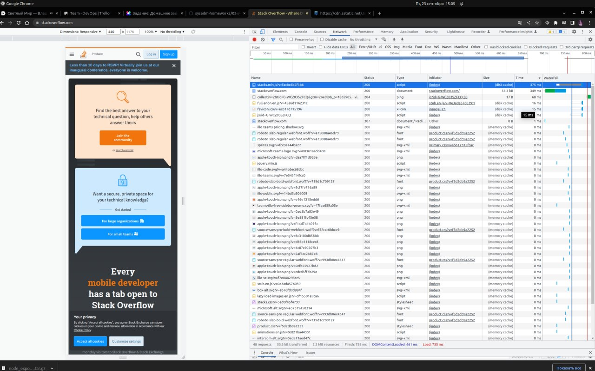

# ДЗ | 3.6.  Компьютерные сети, лекция 1

1.  HTTP/1.1 301 Moved Permanently - 301 это постоянный редирект, с http на https
2.  Первый запрос по http, Status Code: 307 Internal Redirect,  редирект на https.
Дольше всего обрабатывался запрос:
```
https://cdn.sstatic.net/Js/third-party/npm/@stackoverflow/stacks/dist/js/stacks.min.js?v=facbc6b2f3b6
```


3. 
```
ip a | grep enp4s0
```
inet 10.248.104.17 - мой ip, я в рабочей сети
4. Для выполнения этого задания буду использовать ip 195.34.245.17
Lipetsk DSL Dynamic-IP
NetName:        PRIVATE-ADDRESS-ABLK-RFC1918-IANA-RESERVED
```
origin:         AS8570
```
5. Ниже
```
stade@stade-pc:~$ traceroute -A 8.8.8.8
traceroute to 8.8.8.8 (8.8.8.8), 30 hops max, 60 byte packets
 1  _gateway (10.248.104.1) [*]  0.112 ms  0.112 ms  0.127 ms
 2  lptz-bras1.cnt.ip.rostelecom.ru (213.59.207.159) [AS12389]  1.279 ms  1.458 ms  1.329 ms
 3  87.226.146.44 (87.226.146.44) [AS12389]  9.662 ms  2.220 ms 87.226.146.48 (87.226.146.48) [AS12389]  1.061 ms
 4  87.226.183.89 (87.226.183.89) [AS12389]  18.218 ms * 87.226.181.89 (87.226.181.89) [AS12389]  8.283 ms
 5  74.125.51.172 (74.125.51.172) [AS15169]  8.446 ms 72.14.197.6 (72.14.197.6) [AS15169]  27.887 ms 5.143.253.245 (5.143.253.245) [AS12389]  18.182 ms
 6  * * 108.170.250.51 (108.170.250.51) [AS15169]  28.336 ms
 7  142.250.238.214 (142.250.238.214) [AS15169]  24.154 ms 209.85.249.158 (209.85.249.158) [AS15169]  35.594 ms 142.251.238.82 (142.251.238.82) [AS15169]  43.434 ms
 8  72.14.232.190 (72.14.232.190) [AS15169]  33.787 ms 66.249.95.224 (66.249.95.224) [AS15169]  21.061 ms 172.253.65.159 (172.253.65.159) [AS15169]  30.985 ms
 9  172.253.66.116 (172.253.66.116) [AS15169]  25.748 ms 216.239.56.101 (216.239.56.101) [AS15169]  44.889 ms 142.251.238.82 (142.251.238.82) [AS15169]  43.292 ms
10  172.253.65.159 (172.253.65.159) [AS15169]  31.708 ms * 142.251.238.72 (142.251.238.72) [AS15169]  24.654 ms
11  142.250.56.217 (142.250.56.217) [AS15169]  42.404 ms 216.239.58.53 (216.239.58.53) [AS15169]  44.325 ms 172.253.64.55 (172.253.64.55) [AS15169]  34.343 ms
12  * * *
13  * * *
14  * * *
15  * * *
16  * * *
17  * * *
18  * * *
19  * dns.google (8.8.8.8) [AS15169]  25.558 ms *

```
6. avg ping с наивысшем значением - 25.1. Участок 142.250.56.219
7. 8.8.8.8. 8.8.4.4 - адреса публичных серверов для днс запросов. А записи ниже.
```
;; ANSWER SECTION:
dns.google.		324	IN	A	8.8.8.8
dns.google.		324	IN	A	8.8.4.4
```
8. dig -x ${IP}
```
;; ANSWER SECTION:
8.8.8.8.in-addr.arpa.	35810	IN	PTR	dns.google.

;; ANSWER SECTION:
4.4.8.8.in-addr.arpa.	79637	IN	PTR	dns.google.
```