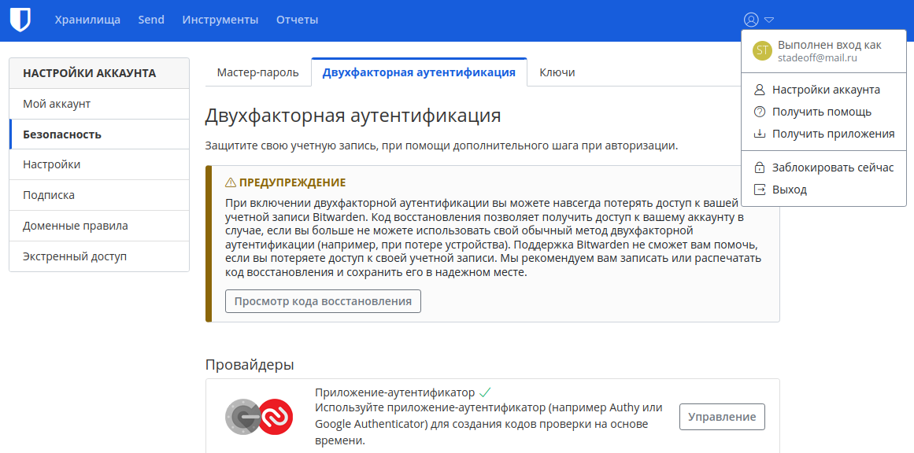
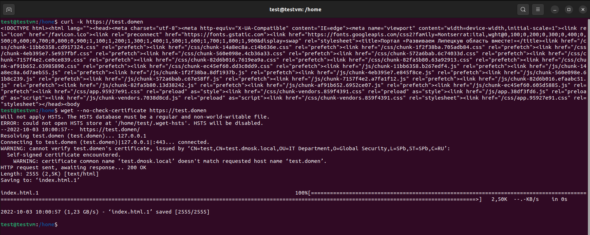
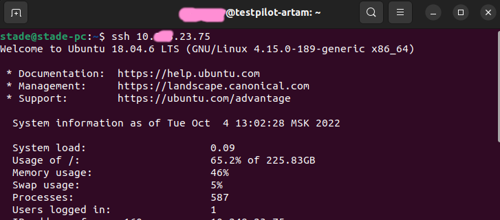
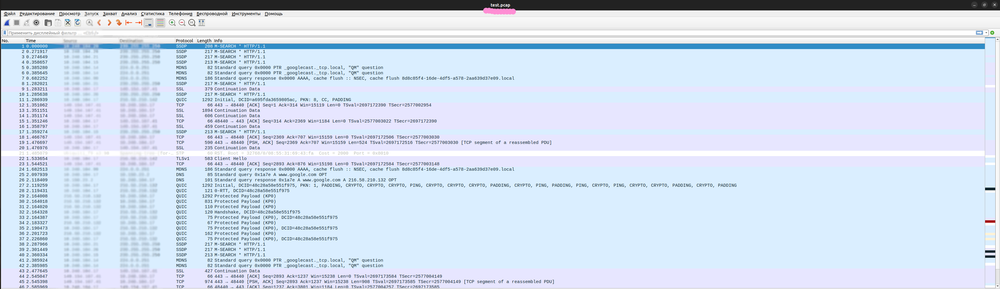

# ДЗ | 3.9 Элементы безопасности информационных систем

1. Установил и сохранил.
2. Скриншот с аутентификацией ниже



3. Выполняю задание на виртуальной машине testvm.

    1. Устанавливаю apache
    2. Cоздаю сертификат в каталоге /etc/apache2/ssl
    ```
    openssl req -new -x509 -days 1461 -nodes -out cert.pem -keyout cert.key -subj "/C=RU/ST=SPb/L=SPb/O=Global Security/OU=IT Department/CN=test.dmosk.local/CN=test"
    ```
    3. Создаю конфигурацию в sites-enable:
    ```
    <VirtualHost *:443>
    ServerName test.domen
    DocumentRoot /home/test/ndba/projects/artamon/dist/
    SSLEngine on
    SSLCertificateFile ssl/cert.pem
    SSLCertificateKeyFile ssl/cert.key
    #SSLCertificateChainFile ssl/cert.ca-bundle
    </VirtualHost>
    ```

    ```
    apachectl configtest
    apachectl graceful
    ```
    4. Добавляю в /etc/hosts домен test.domen к ip 127.0.0.1
    5. Проверяю доступность (curl предупреждает о самоподписанных сертификатах, поэтому использую специальные флаги)



4. Выполняю сканирование в докер контейнере для сайта 32карата.site
```
docker run --rm -ti  drwetter/testssl.sh https://xn--32-8kcaa1d1br.site/
```

```
 Rating (experimental) 

 Rating specs (not complete)  SSL Labs's 'SSL Server Rating Guide' (version 2009q from 2020-01-30)
 Specification documentation  https://github.com/ssllabs/research/wiki/SSL-Server-Rating-Guide
 Protocol Support (weighted)  95 (28)
 Key Exchange     (weighted)  90 (27)
 Cipher Strength  (weighted)  90 (36)
 Final Score                  91
 Overall Grade                B
 Grade cap reasons            Grade capped to B. TLS 1.1 offered
                              Grade capped to B. TLS 1.0 offered
                              Grade capped to A. HSTS is not offered

 Done 2022-10-03 10:32:05 [ 260s] -->> 84.252.73.207:443 (xn--32-8kcaa1d1br.site) <<--
```
5. Выполняю следующие команды :
```
ssh-keygen
```
```
ssh-copy-id user@ip
```
Мой файл ~/.ssh/config (ip и user изменены):

```
Host 10.*.23.96
  HostName 10.*.23.96
  User someuser

Host 10.*.23.26
  HostName 10.*.23.26
  User someuser

Host 10.*.23.13
  HostName 10.*.23.13
  User someuser

Host 10.*.23.170
  HostName 10.*.23.170
  User someuser

Host 10.*.23.103
  HostName 10.*.23.103
  User someuser

Host 10.*.23.246
  HostName 10.*.23.246
  User someuser

Host 10.*.23.75
  HostName 10.*.23.75
  User someuser

Host 10.*.23.20
  HostName 10.*.23.20
  User someuser

Host 10.*.23.63
  HostName 10.*.23.63
  User someuser

Host 10.*.23.166
  HostName 10.*.23.166
  User someuser

Host 10.*.23.60
  HostName 10.*.23.60
  User someuser

Host 10.*.4.24
  HostName 10.*.4.24
  User someuser

Host 10.*.23.16
  HostName 10.*.23.16
  User someuser

Host 10.*.23.188
  HostName 10.*.23.188
  User someuser

Host 10.*.23.30
  HostName 10.*.23.30
  User someuser

Host 10.*.23.40
  HostName 10.*.23.40
  User someuser
```
6. Можно подключаться к серверам по HostName из задания 5 



7. Выполняю команду:
```
sudo tcpdump -c 100 -i enp4s0 -w test.pcap
```
Полученный файл загружаю в Wireshark

