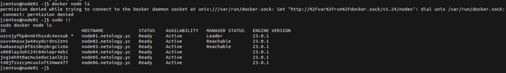
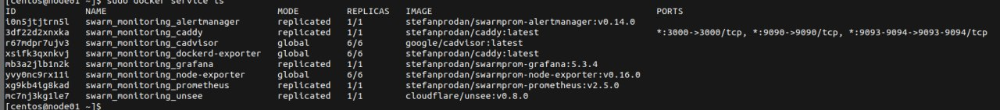

# Домашнее задание к занятию "5. Оркестрация кластером Docker контейнеров на примере Docker Swarm"

1.
    1. Режим работы сервиса replication в Docker Swarm кластере означает, что он распределяет задачи по машинам кластера и поддерживает желаемое количество реплик. Режим global означает, что одна и та же задача запускается на всех машинах кластера.

    2. В Docker Swarm кластере используется алгоритм выбора лидера RAFT. Он обеспечивает согласованность между машинами для управления процессами кластера.

    3. Overlay Network - это сетевой стек, который разрешает  взаимодействие между контейнерами на разных машинах в Docker Swarm кластере. Он поддерживает мультикастовое взаимодействие и позволяет контейнерам выполнять определенные задачи и обмениваться данными.

2. 

```
sudo docker node ls
ID                            HOSTNAME             STATUS    AVAILABILITY   MANAGER STATUS   ENGINE VERSION
ozcnjyfhp8nnkthszdc4xvsuk *   node01.netology.yc   Ready     Active         Leader           23.0.1
usvv4mzuxjw44vydcrdns2zm1     node02.netology.yc   Ready     Active         Reachable        23.0.1
kw0axesgi8f6s58nybrgclz6o     node03.netology.yc   Ready     Active         Reachable        23.0.1
s068lay3ohi24i84niepr4eb1     node04.netology.yc   Ready     Active                          23.0.1
jvg1eh9t0acmu1educ1axlbjz     node05.netology.yc   Ready     Active                          23.0.1
t40jfzvzcymcuuinft2mwe477     node06.netology.yc   Ready     Active                          23.0.1
[centos@node01 ~]$
```

3. 
```
ID             NAME                                MODE         REPLICAS   IMAGE                                          PORTS
i0n5jtjtrn5l   swarm_monitoring_alertmanager       replicated   1/1        stefanprodan/swarmprom-alertmanager:v0.14.0    
3df22d2xnxka   swarm_monitoring_caddy              replicated   1/1        stefanprodan/caddy:latest                      *:3000->3000/tcp, *:9090->9090/tcp, *:9093-9094->9093-9094/tcp
r67mdpr7ujv3   swarm_monitoring_cadvisor           global       6/6        google/cadvisor:latest                         
xsifk3qxnkvj   swarm_monitoring_dockerd-exporter   global       6/6        stefanprodan/caddy:latest                      
mb3a2jlb1n2k   swarm_monitoring_grafana            replicated   1/1        stefanprodan/swarmprom-grafana:5.3.4           
yvy0nc9rx11i   swarm_monitoring_node-exporter      global       6/6        stefanprodan/swarmprom-node-exporter:v0.16.0   
xg9kb4ig8kad   swarm_monitoring_prometheus         replicated   1/1        stefanprodan/swarmprom-prometheus:v2.5.0       
mc7nj3kg1le7   swarm_monitoring_unsee              replicated   1/1        cloudflare/unsee:v0.8.0                        
[centos@node01 ~]$
```