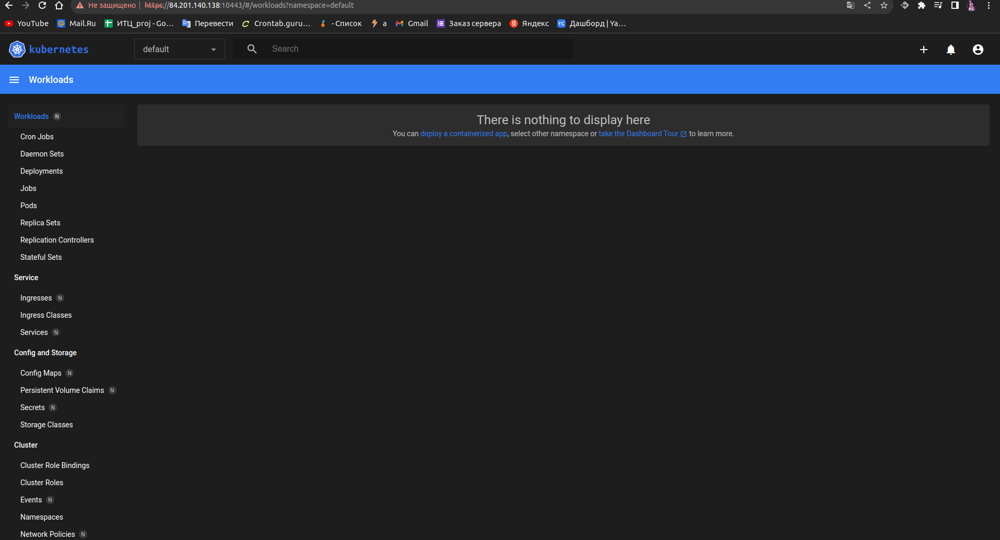

# Домашнее задание к занятию «Kubernetes. Причины появления. Команда kubectl»

## Задание 1. Установка MicroK8S

Установил следуя командам: 

```
sudo apt update,
sudo apt install snapd,
sudo snap install microk8s --classic,
добавить локального пользователя в группу sudo usermod -a -G microk8s $USER,
изменить права на папку с конфигурацией sudo chown -f -R $USER ~/.kube.
```

Включаем аддон "dashboard"

```
microk8s enable dashboard
```

После добавления IP, перегенерим серты:

```sh
sudo microk8s refresh-certs --cert front-proxy-client.crt
```

## Задание 2. Установка и настройка локального kubectl

```sh
user@epdakqkbj051cnbkh7sa:~$ microk8s kubectl port-forward -n kube-system service/kubernetes-dashboard 10443:443
Forwarding from 127.0.0.1:10443 -> 8443
Forwarding from [::1]:10443 -> 8443

```

Смотрю конфигурацию куба и создаю конфигурационный файл kub на локалке.
Далее запрашиваю с локалки список нод указывая конфиг файл.

```sh
stade@stade-A320M-H:~/work$ kubectl get nodes --kubeconfig kub
NAME                   STATUS   ROLES    AGE   VERSION
epdakqkbj051cnbkh7sa   Ready    <none>   62m   v1.27.5

```

**Dashboard connection:**

