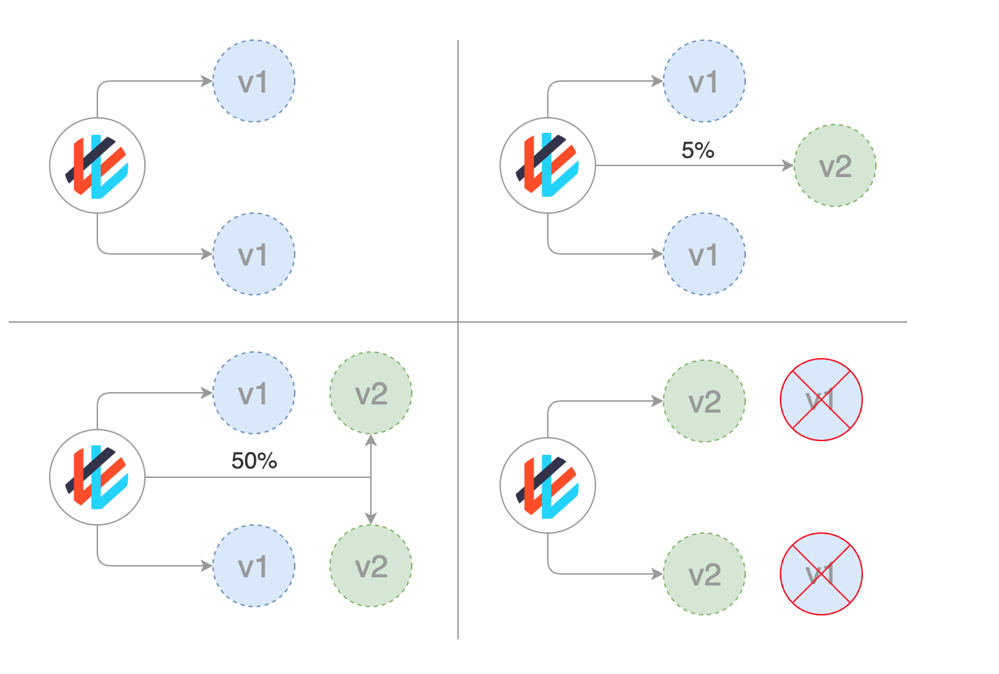

# Домашнее задание к занятию «Обновление приложений»


В данной ситуации, учитывая несовместимость версий, а также минимальное наличие запаса по ресурсам, наилучшей стратегией обновления мне кажется **Canary**.

При использовании стратегии Canary новая версия приложения постепенно внедряется в прод, путем запуска новой версии для небольшого процента пользователей, пока не убедимся, что новая версия работает корректно и стабильно. Это позволяет минимизировать риск ошибок и багов, влияющих на приложение. После успешного тестирования новой версии на ограниченном кол-ве пользователей можно будет уверенно переключить всю нагрузку на новую версию, используя доступные ресурсы эффективно, а также минимизируя влияние на работу приложения в целом.

Можем обратиться к данному скриншоту, но с одним нюансом. Из-за ограниченности ресурсов, нам придется предварительно отключить одну v1 версию приложения, прежде чем запустить вторую v2.



## Обновить приложение

**Создать deployment приложения с контейнерами nginx и multitool. Версию nginx взять 1.19. Количество реплик — 5.**

Не забываем, что контейнеры по умолчанию работают на одинаковых портах, меняем стандартный порт для multitool.

```yml
---
apiVersion: apps/v1
kind: Deployment
metadata:
  name: nginx-multitool
  labels:
    app: nginx-multitool
spec:
  replicas: 5
  selector:
    matchLabels:
      app: nginx-multitool
  template:
    metadata:
      labels:
        app: nginx-multitool
    spec:
      containers:
      - name: nginx
        image: nginx:1.19
        ports:
          - containerPort: 80
      - name: multitool
        image: docker.io/wbitt/network-multitool:latest
        env:
          - name: HTTP_PORT
            value: "81"
        ports:
          - containerPort: 81

```

```
Every 2.0s: kubectl get pods                                                                                                                                         master: Sun Mar 10 12:14:59 2024

NAME                               READY   STATUS    RESTARTS   AGE
nginx-multitool-5877bf7fb9-ckldm   2/2     Running   0          3m5s
nginx-multitool-5877bf7fb9-d99fg   2/2     Running   0          3m4s
nginx-multitool-5877bf7fb9-jl9xm   2/2     Running   0          3m4s
nginx-multitool-5877bf7fb9-kpftn   2/2     Running   0          3m5s
nginx-multitool-5877bf7fb9-shfxh   2/2     Running   0          3m4s
```


**Обновить версию nginx в приложении до версии 1.20, сократив время обновления до минимума. Приложение должно быть доступно.**

Для того, чтобы сократить время обновления, но наше приложение оставалось доступной, мы будем использовать стратегию RollingUpdate с некоторыми параметрами. 


```yml
type: RollingUpdate
    rollingUpdate:
      maxUnavailable: 3
  minReadySeconds: 5
```
maxUnavailable: 3 - показывает максимальное кол-во недоступных подов в один момент времени. 3, это оптимальное значение для ускорения обновления.

minReadySeconds: 5 - время, которое выжидает система после обновления пода, перед тем, как обновлять следующие.


```yml
---
apiVersion: apps/v1
kind: Deployment
metadata:
  name: nginx-multitool
  labels:
    app: nginx-multitool
spec:
  replicas: 5
  strategy:
    type: RollingUpdate
    rollingUpdate:
      maxUnavailable: 3
  minReadySeconds: 5
  selector:
    matchLabels:
      app: nginx-multitool
  template:
    metadata:
      labels:
        app: nginx-multitool
    spec:
      containers:
      - name: nginx
        image: nginx:1.20
        ports:
          - containerPort: 80
      - name: multitool
        image: docker.io/wbitt/network-multitool:latest
        env:
          - name: HTTP_PORT
            value: "81"
        ports:
          - containerPort: 81

```

Обновление прошло быстро и без ошибок

```shell
vagrant@master:~/homework3.4$  kubectl apply -f deployment.yml
deployment.apps/nginx-multitool configured
vagrant@master:~/homework3.4$ kubectl get pods
NAME                               READY   STATUS    RESTARTS   AGE
nginx-multitool-5896fb9bb9-dqcjs   2/2     Running   0          39s
nginx-multitool-5896fb9bb9-hh96c   2/2     Running   0          39s
nginx-multitool-5896fb9bb9-pkftd   2/2     Running   0          39s
nginx-multitool-5896fb9bb9-q4kvz   2/2     Running   0          39s
nginx-multitool-5896fb9bb9-tx69z   2/2     Running   0          39s
```

**Попытаться обновить nginx до версии 1.28, приложение должно оставаться доступным.**

Обновляю версию, после чего наблюдиаем данную картину:

```
Every 2.0s: kubectl get pods                                                                                                                                         master: Sun Mar 10 12:33:28 2024

NAME                               READY   STATUS             RESTARTS   AGE
nginx-multitool-5896fb9bb9-q4kvz   2/2     Running            0          3m24s
nginx-multitool-5896fb9bb9-tx69z   2/2     Running            0          3m24s
nginx-multitool-7c6bb48949-bnb6d   1/2     ImagePullBackOff   0          58s
nginx-multitool-7c6bb48949-ctpfd   1/2     ImagePullBackOff   0          58s
nginx-multitool-7c6bb48949-jhs55   1/2     ImagePullBackOff   0          58s
nginx-multitool-7c6bb48949-qtb5q   1/2     ImagePullBackOff   0          58s
nginx-multitool-7c6bb48949-w6qb7   1/2     ImagePullBackOff   0          58s
```

Приложение осталось доступным.

**Откатиться после неудачного обновления.**

```
vagrant@master:~/homework3.4$ kubectl rollout undo deployment nginx-multitool
```

Видим, что откат к предыдущей версии произошел успешно, все поды запущены и работают корректно

```
Every 2.0s: kubectl get pods                                                                                                                                         master: Sun Mar 10 12:35:56 2024

NAME                               READY   STATUS    RESTARTS   AGE
nginx-multitool-5896fb9bb9-dgzfm   2/2     Running   0          52s
nginx-multitool-5896fb9bb9-hr9n6   2/2     Running   0          52s
nginx-multitool-5896fb9bb9-m2fb6   2/2     Running   0          52s
nginx-multitool-5896fb9bb9-q4kvz   2/2     Running   0          5m52s
nginx-multitool-5896fb9bb9-tx69z   2/2     Running   0          5m52s
```